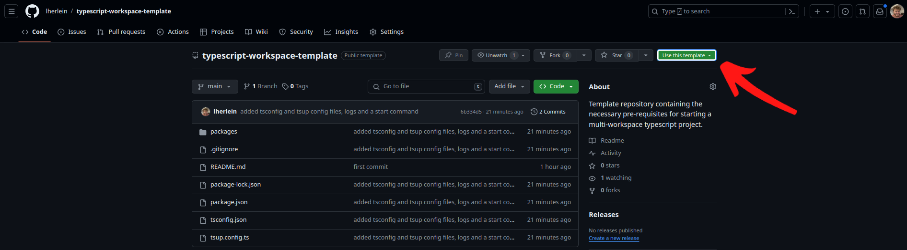
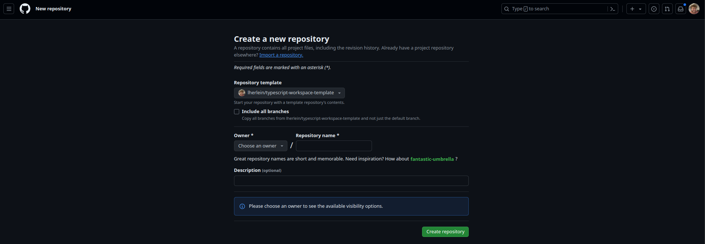

# Typescript Workspace Template

This repo is a template/example meant to 1. show newer Typescript users how to setup a repository of this structure, and 2. provide an easy-to-use template that can kickstart mono-repo TS projects. It uses `tsc` and `tsup` to build and organize the code, `ESLint` to format the code and `jest` to test it. Linting and Testing the code is pre-built into all pushes to main.


[](https://opensource.org/licenses/MIT)


## Table of Contents

- [Typescript Workspace Template](#typescript-workspace-template)
  - [Table of Contents](#table-of-contents)
  - [Installation](#installation)
  - [Usage](#usage)
    - [Repo Structure](#repo-structure)
    - [Editing the Template](#editing-the-template)
    - [Renaming the Packages](#renaming-the-packages)
  - [Key Features](#key-features)
  - [Explanations](#explanations)
  - [License](#license)
  - [Contact](#contact)
  - [Acknowledgements](#acknowledgements)

## Installation

[:arrow_up_small: Back to Top](#typescript-workspace-template)

Installing this template is designed to be as easy as possible. 

:arrow_forward: From the command line:

- `git clone git@github.com:lherlein/typescript-workspace-template.git my-ts-project`
- `cd my-ts-project`

:arrow_forward: From the Github Repo:

- Click on the 'Use this template' button on the Repository page



- Create your new repository



- Clone your new Github repo and navigate to the new directory -> [instructions](https://docs.github.com/en/repositories/creating-and-managing-repositories/cloning-a-repository)

## Usage

[:arrow_up_small: Back to Top](#typescript-workspace-template)

Using this repo is almost as easy as cloning it. Simply type the following commands into the terminal:

- `npm install`
  - You should see a `node_modules` directory be created in the root of the directory
- `npm run build`
  - You should see a `dist` directory be created in each package's directory
- `npm run start`
  - You should see your terminal execute the correct functions and exit with `Code 0` - this means it worked
  - You can see the console.log outputs in the newly created log file for the execution 

### Repo Structure

Your unique modules are stored in individual directories within the `packages/` folder.

```
.
+-- package.json
`-- packages
|  `-- package-a - exporting module
|  |  +-- package.json
|  |  +-- tsup.congig.ts
|  |  +-- tsconfig.json 
|  `-- package-b - server package
|  |  +-- package.json
|  |  +-- tsup.congig.ts
|  |  +-- tsconfig.json
+-- tsup.congig.ts
+-- tsconfig.json
```

In this example, `package-b` relies on `package-a`. It is imported with a simple `import packageA from package-a` to be used within package-b.

`package-b` in this example represents an app, something that imports and uses modules from elsewhere in this mono-repo and the world. It needs to be started and needs to have logs captured. `package-a` is simply a module and is purely exported. Logs do not need to be taken for this package. 

However, should you want to have `package-a` 'start' and have logs, add the following scripts to the root `package.json`.

```
"start:package-b": "sh -c 'npm --prefix packages/package-b run start > ./packages/package-b/logs/package-b-$(date +\"%Y-%m-%d_%H-%M-%S\").log 2>&1'",
"start": "concurrently \"npm run start:package-a\" \"npm run start:package-b\""
```

### Editing the Template

[:arrow_up_small: Back to Top](#typescript-workspace-template)

Once you get the template into your local dev space, you're going to want to start editing. Package A and Package B are unique, standalone typescript modules. To edit them, simply develop code within the `src` folder of the appropriate package. You can either treat the package directory as the new 'root', or work from the real root of the repository. 

For the former, the development of the module would be identical to normal. IE - running `npm install fs` will install `fs` into only the package of the directory you're working from. 

For the latter, there are extra considerations you have to make - you can read about npm workspaces [here](https://docs.npmjs.com/cli/v8/using-npm/workspaces). To get started, to install an npm package into one of your packages, you'd run `npm install --workspaces=package-a fs`. 

### Renaming the Packages

You may want to rename package-a and package-b to better-represent your module(s). In order to do this, first change the directory name of the package. Next, within the package's `package.json`, rename the package `name` and the directory location. Finally, replace every instance of the old package name in the root `package.json` to the new name you want. Once this is done, you can run `npm install` to verify everything worked.

To rename `package-a` to `my-module`, change `packages/package-a/` to `packages/my-module`. Then edit `packages/my-module/package.json` and change the `name` field to `my-module` (it was `package-a`). Finally, do a find and replace on `package-a` in `./package.json` and replace it with `my-module`. Run a `npm install` to finish up and make sure everything was successfull.

## Key Features

[:arrow_up_small: Back to Top](#typescript-workspace-template)

This repository structure is most commonly known as a mono-repo. It is a single repository that holds multiple unique modules. Here's the list of features:

- **TypeScript Ready**: Fully configured TypeScript support for seamless development and type-checking across all workspaces.
- **NPM Workspaces**: Efficiently manage multiple packages within a single repository using npm workspaces, making dependency management and project organization easier.
- **Modular Structure**: Designed with a clear and scalable structure, promoting better code organization and easier maintenance.
- **Shared Configurations**: Centralized configurations for tsConfig, ensuring consistent coding standards and streamlined setup. Apply other configs the same way `tsconfig` is applied in this repo for centralized configs for other tools like ESLint and Prettier/Prettier.
- **Automated Builds and Tests**: Pre-configured scripts for building and testing all workspaces, improving development workflow and CI/CD integration.
- **Inter-Package Dependencies**: Simplified linking and dependency management between workspaces, facilitating better collaboration and integration within the monorepo.
- **Code Quality Tools**: Integrated with code quality tools such as ESLint and Prettier for maintaining high code standards and ensuring clean, readable code.
- **Extensible and Customizable**: Easily extend and customize the template to fit the specific needs of your projects and teams.
- **Example Workspaces**: Includes example workspaces to demonstrate best practices and provide a quick start for adding new packages.
- **Documentation and Support**: Comprehensive documentation to guide you through setup, configuration, and best practices for managing a TypeScript monorepo with npm workspaces.

## Explanations

[:arrow_up_small: Back to Top](#typescript-workspace-template)

## License

Distributed under the MIT License. See `LICENSE` for more information. 

## Contact

The best way to provide feedback on this repository is to open up a Github Issue -> [Template Issues](https://github.com/lherlein/typescript-workspace-template/issues). 

## Acknowledgements

Huge thank you to [Jag Reehal](https://github.com/jagreehal) for teaching me how to do all of this and making me a much better TypeScript coder.